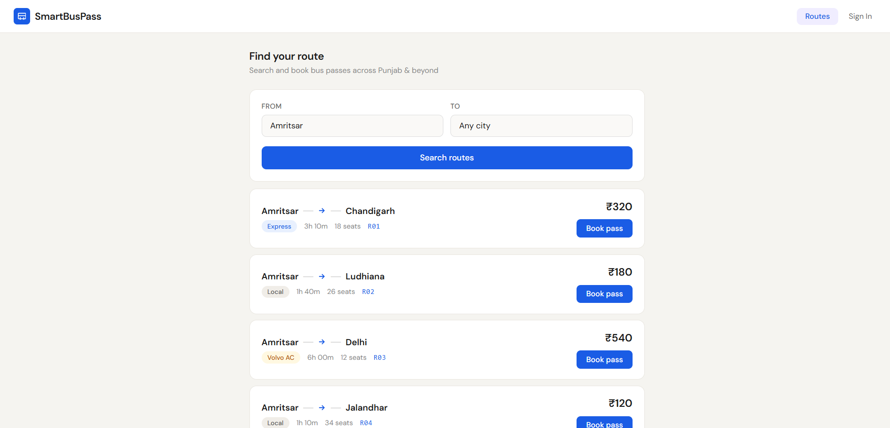
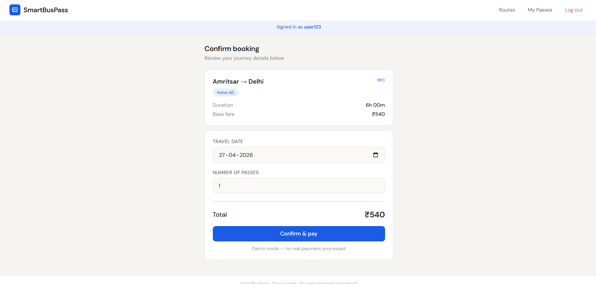
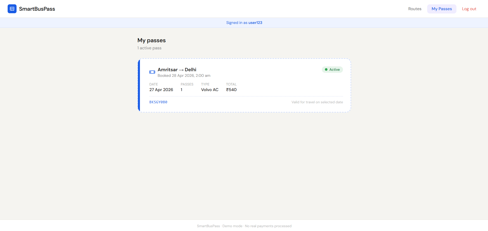

# 🚍 SmartBusPass

A **cloud-based bus pass booking system** demonstrating **DevSecOps practices** in a full-stack application.

---

## 🌐 Live Demo

👉 https://smartbuspass-wowa.onrender.com

---

## 📌 Overview

SmartBusPass is a minimal, interactive web application that allows users to search routes, book bus passes, and manage their bookings.

The project is designed not just as an application, but as a **demonstration of DevSecOps principles**, integrating security and deployment practices into the development lifecycle.

---

## ⚙️ Features

* 🔐 User Authentication (JWT-based)
* 🚌 Route Search & Booking
* 🎫 Digital Pass Management
* ⚡ Rate Limiting for API Protection
* 🌐 Cloud Deployment

---

## 🛠 Tech Stack

| Layer      | Technology                 |
| ---------- | -------------------------- |
| Frontend   | HTML + React (CDN)         |
| Backend    | Node.js, Express           |
| Database   | SQLite                     |
| Security   | JWT, bcrypt, rate limiting |
| Deployment | Render                     |

---

## 🔐 DevSecOps Practices Implemented

* **Authentication Security** → JWT-based authentication
* **Password Protection** → bcrypt hashing
* **API Security** → rate limiting to prevent abuse
* **Configuration Management** → environment variables (`.env`)
* **Cloud Deployment** → deployed on Render
* **Modular Architecture** → scalable and CI/CD-ready structure

---

## 📁 Project Structure

```
smartbuspass/
 ├── server.js
 ├── routes/
 ├── middleware/
 ├── db/
 ├── public/
 │    └── index.html
 ├── package.json
```

---

## 🚀 Running Locally

1. Clone the repository
2. Install dependencies

   ```
   npm install
   ```
3. Create `.env` file

   ```
   JWT_SECRET=your_secret_key
   ```
4. Start server

   ```
   node server.js
   ```
5. Open browser

   ```
   http://localhost:3001
   ```

---

## 🧠 DevSecOps Perspective

This project demonstrates how security can be integrated into the development lifecycle:

* Secure coding practices
* API-level protection
* Environment-based configuration
* Deployment-ready architecture

It can be extended with:

* CI/CD pipelines (GitHub Actions)
* Automated security scanning
* Containerized deployment

---

## 📌 Future Enhancements

* CI/CD pipeline integration
* Role-based authentication
* Real-time seat availability
* Containerization using Docker

---

## 📸 Preview

### Home Page


### Booking Page


### My Pass


---

## 👨‍💻 Author

Vaibhav Pratap Singh
B.Tech Computer Science Engineering

---
